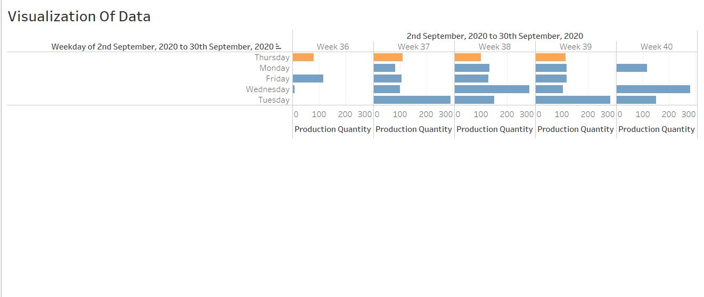

# Production Quantity Analysis for September 2020

## Overview
This section accompanies the visualizations of daily production quantities for September 2020, spanning from the 2nd to the 30th. The data is broken down by weekdays and visualized over several weeks to help identify trends and patterns in production efficiency.

## File Structure
- `image1.jpg`: Stacked bar chart showing daily production quantity by weekday for each week (Weeks 36 to 40).
- `image2.jpg`: Bar chart aggregating total production quantity by weekday throughout the month.
- `image3.jpg`: Alternate version of the stacked bar chart with similar data as `image1.jpg`.

## Visualizations
1. **Weekly Production Overview**
   - **Description**: Visualization of the production quantity broken down by weekdays across Weeks 36 to 40.
   - **Insight**: Highlights fluctuating production with peaks on Tuesdays and dips on Thursdays.
   

2. **Total Monthly Production by Weekday**
   - **Description**: Aggregated total production quantity by weekdays throughout the entire month.
   - **Insight**: Shows overall highest and lowest production days, with Tuesday having the maximum production.
   

3. **Detailed Weekly Breakdown**
   - **Description**: A detailed stacked bar chart providing another perspective of daily production across the observed weeks.
   - **Insight**: Reinforces observations from the first visualization regarding variability in daily production.
   

## Analysis Summary
The presented data highlights the variability in production across different days of the week. Key observations include:
- **High Production**: Tuesdays show significantly higher production levels compared to other weekdays.
- **Low Production**: Thursdays consistently show lower production levels, which could be an area for operational review.
- **Mid-Week Peak**: Production tends to peak mid-week, suggesting a ramp-up in operations post-Monday.

These insights can assist in optimizing resource allocation, improving operational efficiency, and planning better for future production needs.

